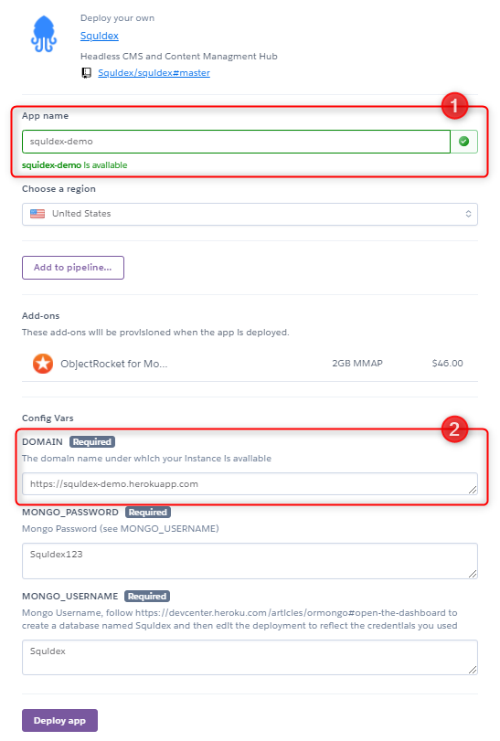
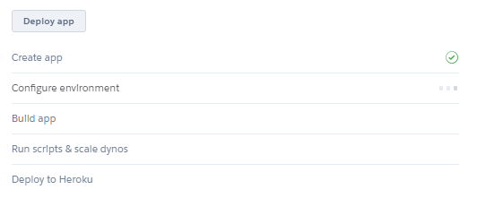
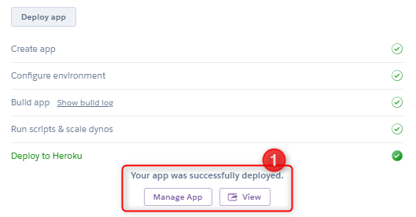
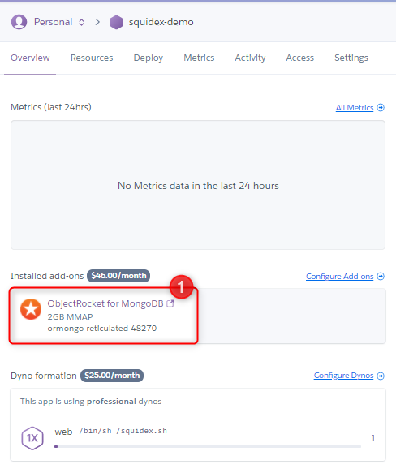
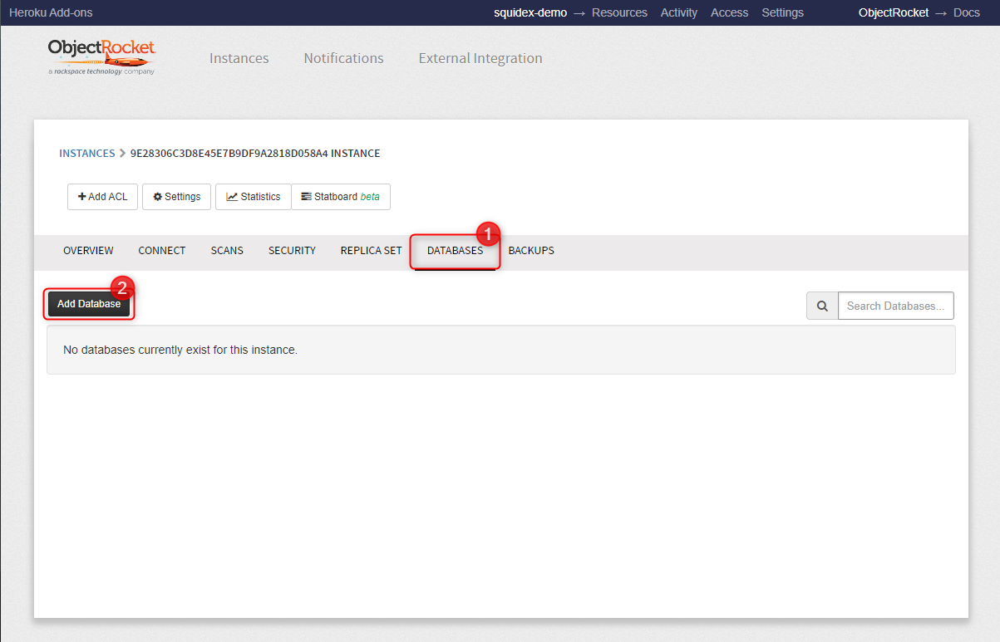
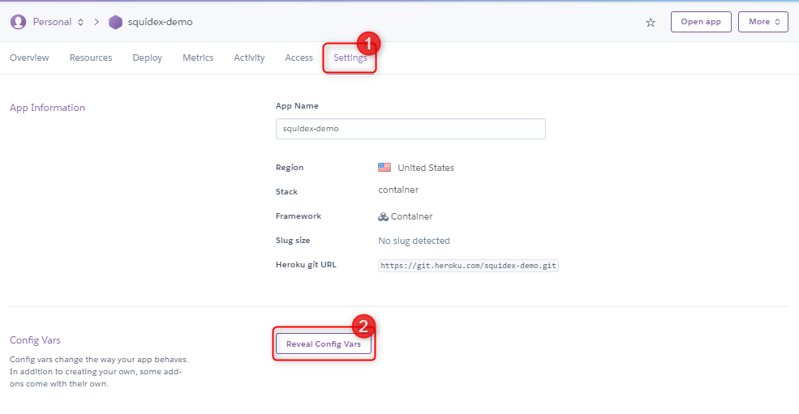
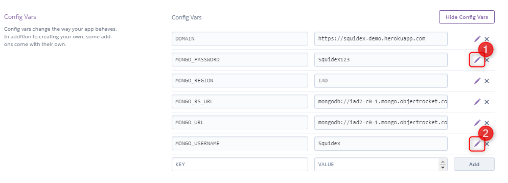
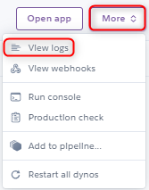

# Install on Heroku

## 1. Use the 1-click deploy button

## 2. Fill in the details

Make sure to fill in the **App name** (1) field with something unique, and then fill the **DOMAIN** (2) variable with the external domain you wish your Squidex instance to be available on.

You can ignore MONGO\_USERNAME and MONGO\_PASSWORD for now.

When you are done, click **Deploy App**.

## 3. Wait for the deployment to complete

When it's finished, click **Manage app** (1).

## 4. Create MongoDB database and credentials

On the Dashboard, click **ObjectRocket for MongoDB** (1)**.**

On the ObjectRocket Dashboard, click **DATABASES** (1) and then **Add Database** (2).

Enter the **database name** (1) (must be `squidex`), the **username and the password** (2). Keep note of those, as you will be needing them for the next step.

## 5. Fill in the database credentials

Back at the Heroku Dashboard, click **Settings** (1), then click **Reveal Config Vars** (2).

Fill the fields `MONGO_PASSWORD` (1) and `MONGO_USERNAME` (2) with the same credentials you provided in the previous step.

You should then be ready to go!

## Troubleshooting

Please check the logs by clicking **More**, and then **View logs.**

### Restart dynos

In case the deployment gets stuck, go to the top right of the dashboard, click **More** and then **Restart all dynos**.

### More issues?

It is very likely a configuration problem and not related to hosting under Docker. Checkout


[configuration.md](../configuration.md)

