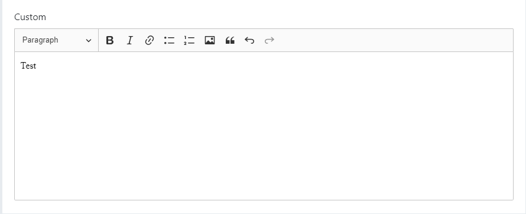
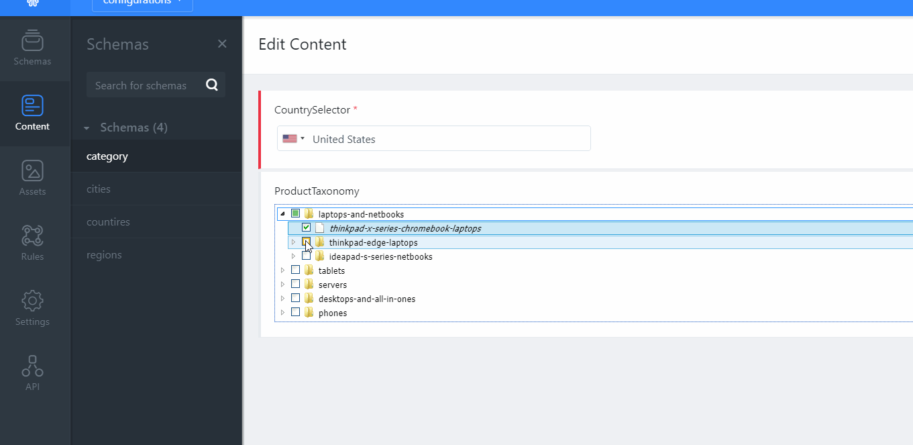

# Custom Editors

## How to write your own editor

Custom editors are enabling developers to replace the default editors with HTML5 applications so that the editing experience of the Squidex Web App can be customized.

Technically speaking a UI editor lives in a sandboxed iframe,which interacts with the web application through a small SDK using messaging. This SDK is a proxy of the Angular [ControlValueAccessor](https://angular.io/api/forms/ControlValueAccessor), without having the dependencies to Angular itself.


Lets see how the code looks like:

```markup
<!DOCTYPE html>
<html>

<head>
    <meta charset="utf-8">

    <!-- Load the editor sdk from the local folder or https://cloud.squidex.io/scripts/editor-sdk.js -->
    <script src="editor-sdk.js"></script>
    <script src="https://cdn.ckeditor.com/ckeditor5/10.0.0/classic/ckeditor.js"></script>

    <style>
        .ck-editor__editable {
            min-height: 250px;
        }
    </style>
</head>

<body>
    <textarea name="content" id="editor"></textarea>

    <script>
        var element = document.getElementById('editor');
        ClassicEditor
            .create(element)
            .catch(error => {
                console.error(error);
            })
            .then(editor => {
                // When the field is instantiated it notified the UI that it has been loaded.
                var field = new SquidexFormField();
                // Handle the value change event and set the text to the editor.
                field.onValueChanged(function (value) {
                    if (value) {
                        editor.setData(value);
                    }
                });
                // Disable the editor when it should be disabled.
                field.onDisabled(function (disabled) {
                    editor.set('isReadOnly', disabled);
                });
                editor.model.document.on('change', function () {
                    var data = editor.getData();
                    // Notify the UI that the value has been changed. Will be used to trigger validation.
                    field.valueChanged(data);
                });
                editor.ui.focusTracker.on('change:isFocused', function (event, name, isFocused) {
                    if (!isFocused) {
                        // Notify the UI that the value has been touched.
                        field.touched();
                    }
                });
            });
    </script>
</body>

</html>
```

You just have to reference the editor SDK and handle the events. You also have to push the current value to the web application whenever it changes. Validation will happen automatically then.

## API

The `SquidexFormField` class is the entry point to your editor. 

Create a new instance when your editor is initialized.

### Methods

| Name | Description |
| :--- | :--- |
| `editor.getValue()` | Gets the current value of the field. |
| `editor.getContext()` | Gets the current context information. More about that later. |
| `editor.getFormValue()` | Gets the current value of the content form. Can be used to access the values of other fields. |
| `editor.getLanguage()` | Get the language of the field editor.  If the field is not localized the master language is passed through. |
| `editor.isDisabled()` | Get the current disabled state of the field form. Disabled \(`true`\) or Enabled \(`false`\). |
| `editor.isFullscreen()` | Get the current fullscreen state of the field form. Fullscreen on \(`true`\) or off \(`false`\). |
| `editor.touched()` | Notifies the control container that the editor has been touched, must be called when your custom editor looses the focus. |
| `editor.clean()` | Cleanup the editor. Usually it is not needed to call this method. |
| `editor.onInit(callback)` | Register a function that is invoked when the messaging communication with the management UI is established. After the callback is invoked you get retrieve values with the get methods. The context object will be passed to the callback. |
| `editor.onDisabled(callback)` | Register a function that is invoked whenever the editor should either be enabled or disabled. A boolean value will be passed with either `true` \(disabled\) or `false` \(enabled\). |
| `editor.onValueChanged(callback)` | Register a function that is invoked whenever the value of the field has changed. The value will be passed to the callback as argument. |
| `editor.onFormValueChanged(callback)` | Register a function that is invoked whenever the value of the content form has changed. The value will be passed to the callback as argument. |
| `editor.onLanguageChanged(callback)` | Register a function that is invoked whenever the language of the field is changed, because in same cases the editor is shared between languages. If the field is not localized the master language is passed through. |
| `editor.onFullscreen(callback)` | Register a function that is invoked whenever the fullscreen mode is changed. The function has one argument with the the fullscreen mode. |
| `editor.navigate(url)` | Navigates the Management UI to a new URL. Because the plugin is integrated as an iframe, you cannot use normal links as it would only change the URL within the iframe and not the URL of the Management UI. |
| `editor.toggleFullscreen()` | Toggle the fullscreen mode and sends the current state to the management UI. The field editor is destroyed and recreated because it has to be moved inside the DOM. Therefore `onInit` is invoked again. |

### Context

The context object contains application information, such as the username and access token.

Example:

```javascript
{
  "user": {
    "user": {
      "id_token": "TOKEN",
      "session_state": "TOKEN",
      "access_token": "TOKEN", // Access Token
      "token_type": "Bearer",  // Access Token Type
      "scope": "openid profile email squidex-profile role permissions squidex-api",
      "profile": {
        "s_hash": "Wn3eHEjfi65aLx-KioJ53g",
        "sid": "-S7htcpBlnhNKfBXLhl1rg",
        "sub": "5dc32104ebc77a363cca0e0c", // User Id
        "auth_time": 1573240790,
        "idp": "Google",
        "amr": [
          "external"
        ],
        "urn:squidex:name": "USERNAME",
        "urn:squidex:picture": "URL",
        "urn:squidex:permissions": "squidex.admin.*",
        "email": "hello@quidex.io",
        "email_verified": false
      },
      "expires_at": 1573405262
    }
  },
  "apiUrl": "http://localhost:5000/api",
  "appName": "my-app"
}
```

You can use `apiUrl`, `access_token` and `token_type` to retrieve additional information from the API, for example when you build a special editor to manage references or assets.

## Example editors

Squidex contains a few example editors that can help you to understand the flow, for example:

* [https://cloud.squidex.io/scripts/editor-context.html](https://cloud.squidex.io/scripts/editor-context.html): Demonstrates the structure of the context object by displaying the JSON representation in a text field.
* [https://cloud.squidex.io/scripts/editor-combined.html](https://cloud.squidex.io/scripts/editor-combined.html): Demonstrates how to use the values of the other fields to calculate the value of the current field.
* [https://cloud.squidex.io/scripts/editor-log.html](https://cloud.squidex.io/scripts/editor-log.html): Demonstrates the different callbacks by logging them the Browser console.
* [https://cloud.squidex.io/scripts/editor-simple.html](https://cloud.squidex.io/scripts/editor-simple.html): Demonstrates how to integrate the CKE editor into Squidex.

## All Examples

Also, we have more example you can use them on your apps.

### 1. Simple CKE Editor

Reference: [https://squidex.github.io/squidex-samples/editors/cke-simple.html](https://squidex.github.io/squidex-samples/editors/cke-simple.html)



Clone the sample and configure the CKE editor as you need it.

### 2. Country selector

Reference: [https://squidex.github.io/squidex-samples/editors/country-selector.html](https://squidex.github.io/squidex-samples/editors/country-selector.html)


### 3. Product taxonomy

Reference: [https://squidex.github.io/squidex-samples/editors/tags-category.html](https://squidex.github.io/squidex-samples/editors/tags-category.html)

The data format is a list of URL like paths for each product category that will be converted to a tree structure.

```javascript
[
  "/laptops-and-netbooks/thinkpad-x-series-chromebook-laptops/",
  "/laptops-and-netbooks/thinkpad-edge-laptops/thinkpad-edge-e330/",
  "/laptops-and-netbooks/ideapad-s-series-netbooks/ideapad-s210-notebook/",
  "/tablets/a-series/a2109-tablet/",
  "/servers/thinkserver/rs110/6438/",
  "/desktops-and-all-in-ones/thinkcentre-m-series-desktops/m715q/10m2/",
  "/phones/a-series/a328-smartphone/"
]
```



### 4. JSON Tree

Reference: [https://squidex.github.io/squidex-samples/editors/jstree-editor.html](https://squidex.github.io/squidex-samples/editors/jstree-editor.html)

Create a visual tree for a JSON object.


### 5. JSON Schema Editor

Reference: [https://squidex.github.io/squidex-samples/editors/react-jsonschema.html](https://squidex.github.io/squidex-samples/editors/react-jsonschema.html#https://gist.githubusercontent.com/SebastianStehle/4bb9ef57258dd95e98a19d738fdc9c2b/raw/52112bc67905f27b6f6d7754bf2e40dc40646087/schema.json)

This editor downloads json schema from the URL that is defined via the URL fragment \(everything after \#\):

[https://squidex.github.io/squidex-samples/editors/react-jsonschema.html\#https://gist.githubusercontent.com/SebastianStehle/4bb9ef57258dd95e98a19d738fdc9c2b/raw/52112bc67905f27b6f6d7754bf2e40dc40646087/schema.json](https://squidex.github.io/squidex-samples/editors/react-jsonschema.html#https://gist.githubusercontent.com/SebastianStehle/4bb9ef57258dd95e98a19d738fdc9c2b/raw/52112bc67905f27b6f6d7754bf2e40dc40646087/schema.json)


