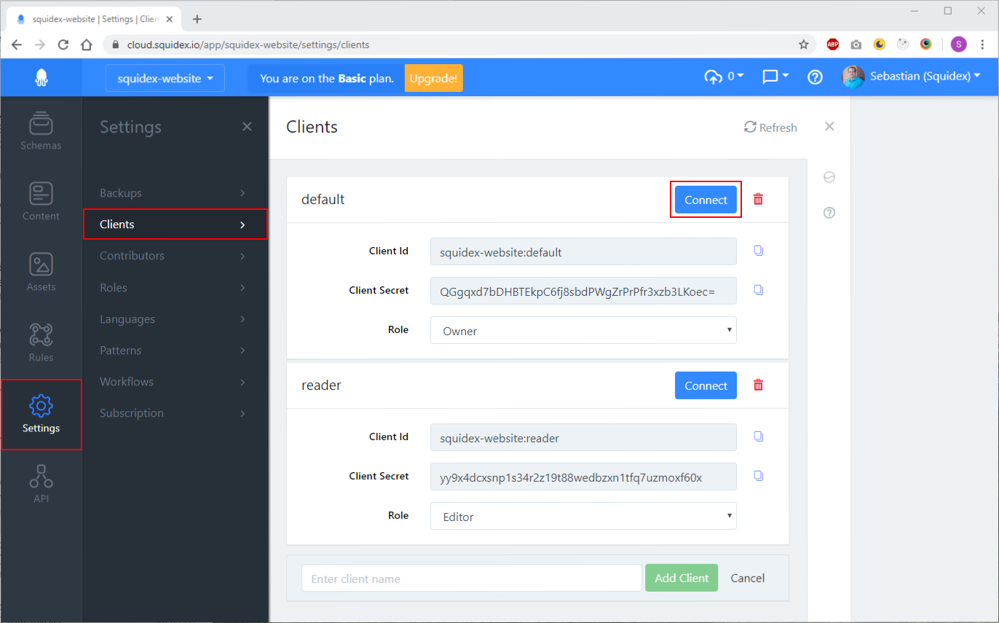
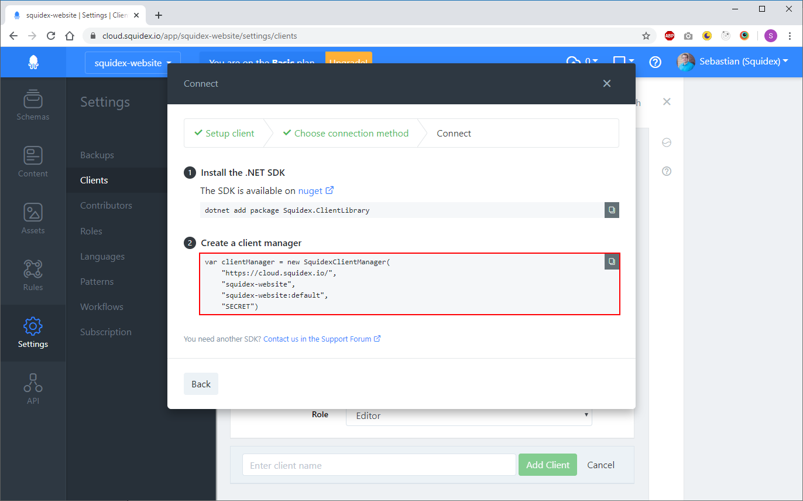

# .NET Standard

## Introduction

The SDK is mostly generated from the OpenAPI specification:[ https://cloud.squidex.io/api/docs](https://cloud.squidex.io/api/docs).

This means that the API is fully covered, including all endpoints that are also used by the frontend. You can also use the SDK to create and configure apps, schemas and rules.

The downside is that some of the methods are not as user friendly as they could be. Most methods have the app name as an required parameter, which is redundant because the SDK is designed to mainly connect to a single app anyway and has the app name as a global configuration option.

## Generating content classes

Because of localization the OpenAPI specification and the generated classes are very difficult to use, especially if your fields are not localized. Therefore we recommend to create the mapping classes for your schemas manually.  But of course you can also use OpenAPI to generate them.

Our recommendation is to use [NSwag ](https://github.com/RicoSuter/NSwag)for that. The code generator is also available as a class library to you automated the code generation in your CI pipeline.

## How to use the SDK?

### 1. Install the SDK

The SDK is available on [nuget.org](https://www.nuget.org/packages/Squidex.ClientLibrary/). You can install it with:

```bash
dotnet add package Squidex.ClientLibrary
```

### 2. Instantiate the client manager

The main entry class is the `SquidexClientManager` which maintains the authentication and provides methods to create client classes for different endpoints.

To instantiate the client manager you need your app name, the client id and secret.

```csharp
var clientManager =
    new SquidexClientManager(
        new SquidexOptions
        {
            AppName = "...",
            ClientId = "...",
            ClientSecret = "...",
            Url = "https://cloud.squidex.io"
        });
```

Just go the clients screen in your app and click the connect button.



Then follow the third link to get instructions how to connect with the SDK:


You can just copy and paste the sample code to your source file.



The client manager will create an access token using your client credentials automatically and cache this token in memory for 30 days. When the token expires the token will be recreated automatically.

Read more about the authentication flow and best practices:



### 2. Create concrete clients

The next step is to create concrete clients, e.g. when you want to query or upload assets you need the assets client:

```csharp
var assetsClient = clientManager.CreateAssetsClient();
```

The clients are designed to be reused. When you make use of a dependency system container you can also register them as singleton.

For example when working with [Microsoft.Extensions.DepencencyInjection](https://docs.microsoft.com/en-US/aspnet/core/fundamentals/dependency-injection?view=aspnetcore-3.1):

```csharp
public void AddSquidexServices(IServiceCollection services)
{
    var clientManager =
        new SquidexClientManager(
            new SquidexOptions
            {
                AppName = "...",
                ClientId = "...",
                ClientSecret = "...",
                Url = "https://cloud.squidex.io"
            });
        
    services.AddSingleton(clientManager);
    
    services.AddSingleton<IAssetsClient>(c =>
        c.GetRequiredServices<SquidexClientManager>()
            .CreateAssetsClient());
}
```

The interfaces can then be replaced with Mocks for automated tests, if needed.

## How to work with contents?

As mentioned before dealing with contents requires more work.

### Why no code generation?

The reason is the json structure of the content data. Lets assume we have a `blog-post` schema with two fields, a localized `title` field and normal \(invariant\) `slug`field. The resulting content response will look like this then:

```javascript
{
   "title": {
      "en": "Hello Squidex",
      "de": "HALLO Squidex"
   },
   "slug": {
      "iv": "hello-squidex"
   }
}
```

When you map a structure to a C\# class, every json object is mapped to either a Dictionary or a class.

A a code generator would then create the following class structure and would also convert all json property names to a Pascal-Case naming to align the naming with the C\# conventions. So whenever you work with invariant fields you have to access the `Iv` property to get access to the value.

```csharp
public class BlogPostTitle {
    public string En { get; set; }
    public string De { get; set; }
}

public  class BlogPostSlug {
    public string Iv { get; set; }
}

public class BlogPostData {
    public BlogPostTitle Title { get; set; }
    
    public BlogPostSlug Slug { get; set; }
}
```

Therefore we create the classes manually:

### 1. Create your class model

For each schema you want to consume, two classes are needed.

The data object is the structure of your content data:

```csharp
public sealed class BlogPostData
{
    // The invariant converter converts the object to a flat property.
    [JsonConverter(typeof(InvariantConverter))]
    public string Slug { get; set; }

    // For localizable fields you can use dictionaries.
    public Dictionary<string, string> Title { get; set; }
}
```

We also create another class for the blog post itself, which holds the data and metadata.

```csharp
public sealed class BlogPost : Content<BlogPostData>
{
}
```

#### How to map fields to .NET types

It depends on your field type, which .NET type you use for a field.

Our recommendation:

| Field Type | .NET Type |
| :--- | :--- |
| Assets | `System.Collections.Generic.List<System.Guid>` |
| Boolean | `bool` |
| DateTime | `System.DateTime` or `System.DateTimeOffset` |
| Geolocation | A custom class. |
| Json | `Newtonsoft.Json.Linq.JObject` or a custom class. |
| Number | `double` |
| References | `System.Collections.Generic.List<System.Guid>` |
| String | `string` |
| Tags | `System.Collections.Generic.List<Sstring>` |
| Array | A custom class. |

#### Geolocation classes

At the moment the SDK does not provide a ready to use structure for geolocations, but you can use the following class:

```csharp
public class Geolocation 
{
    public double Latitude { get; set; }
    public double Longitude { get; set; }
}
```

#### Arrays

When you have an array field you need a class for your array items, for example:

```csharp
public class Comment 
{
    public string Author { get; set; }
    
    public string Text { get; set; }
}

public sealed class BlogPostData
{
    // For invariant array fields.
    [JsonConverter(typeof(InvariantConverter))]
    public List<Comment> Comments { get; set; }

    // For localized array fields.
    public Dictionary<string, List<Comment>> Comments  { get; set; }
}
```


Please note that the `InvariantConverter`is only needed for root fields.


### 2. Instantiate the client

Next to have to use a client again. You have to pass in the name of your schemas an argument and the two created classes as type arguments.

```csharp
var client =
    clientManager
        .CreateContentsClient<BlogPost, BlogPostData>("blog-post");
```

The client is also designed to be reused, but when you complex queries our recommendation is to create a wrapper class and to register the wrapper in the service container to make testing easier.

### 3. Use the client

Using the client is very easy, for example:

#### Get a content item by id

```csharp
var id = Guid.Parse("xxx...");

var post = await client.GetAsync(id);

var slug = post.Data.Slug;
var titleEN = post.Data.Title["en"];
var titleDE = post.Data.Title["de"];
```

#### Create a new content item

```csharp
var data = new BlogPostData
{
    Slug = "hello-squidex",
    Title = new Dictionary<string, string>
    {
        ["en"] = "Hello Squidex",
        ["de"] = "Hallo Squidex"
    }
}
```

#### Query items by filter

```csharp
var posts = await client.GetAsync(filter: $"data/slug/iv eq '{slug}'");
```

## More samples

We also use the .NET client for API tests. The do cover all endpoints yet, but are helpful reference:

[https://github.com/Squidex/squidex/blob/master/backend/tools/TestSuite/TestSuite.ApiTests/AssetTests](https://github.com/Squidex/squidex/blob/master/backend/tools/TestSuite/TestSuite.ApiTests/AssetTests.cs)

